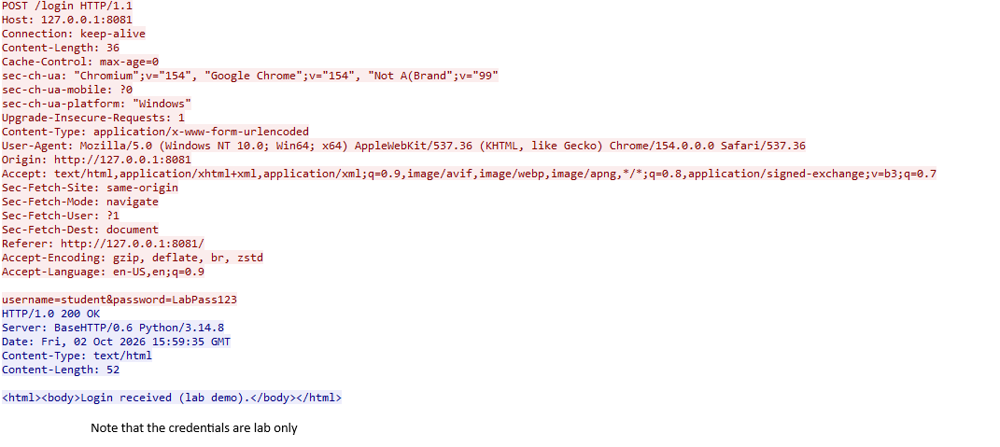
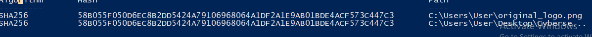

## Exercise 3 — Reading the TCP Three-Way Handshake
The captured traffic shows the TCP three-way handshake:SYN-SYN-ACK-ACK that establishes a TCP connection
Exercise 3 screenshot:

## Exercise 4 — Follow HTTP Stream
Used Wireshark's Follow HTTP Stream feature to view the communication between a client and a server. Credentials shown are for lab use only.

## Exercise 7- Exporting Objects (Extracting a File)
These are the two matching SHA-256 hashes

## Exercise 8- Recognizing a Port Scan
The SYN result indicates a scan because they show multiple SYN packets sent to different ports.

